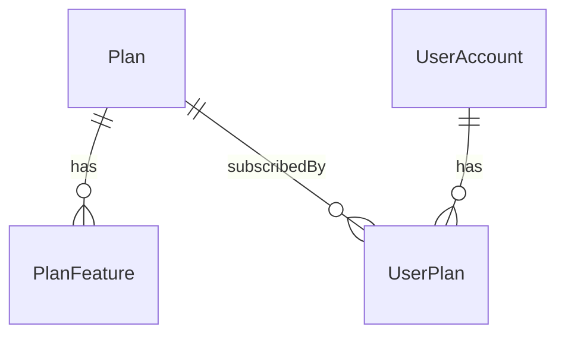

# Plans Feature

This document describes the Plans feature: entities, DTOs, CQRS flow, and REST endpoints.

## Entities

- Plan: `Id`, `Name`, `Code` (unique), `Description`, `PriceMonthly`, `PriceYearly`, `IsPublic`, base entity fields.
- PlanFeature: key-value pairs associated with a Plan (`Key`, `Value`, `Unit`). Unique per `(PlanId, Key)`.
- UserPlan: subscription relation between `UserAccount` and `Plan` with `StartDate`, optional `EndDate`, and `AutoRenew`.

## Relationships

## DTOs

- CreatePlanDto: `Name`, `Code`, `Description`, `PriceMonthly`, `PriceYearly`, `IsPublic`, `Features`
- UpdatePlanDto: `Name?`, `Description?`, `PriceMonthly?`, `PriceYearly?`, `IsPublic?`, `IsActive?`, `Features?`
- PlanDto: full plan representation with features
- UserPlanDto: subscription representation

## CQRS

- Commands: `CreatePlanCommand`, `UpdatePlanCommand`, `DeletePlanCommand`
- Queries: `GetPlanByIdQuery`, `GetPlansQuery`
- Handlers delegate to `IPlanService`
- Validators enforce core rules (name/code lengths, prices >= 0, features not null, etc.)

## Endpoints

- `GET /api/plans` → list plans
- `GET /api/plans/{id}` → plan by id
- `POST /api/plans` → create plan
- `PUT /api/plans/{id}` → update plan
- `DELETE /api/plans/{id}` → delete plan

Controller uses IMediator and returns standardized results.

## Notes

- EF configurations enforce unique code, cascade for PlanFeature, restrict delete for UserPlan.
- Service marked with `[InjectAsScoped]` per DI convention.